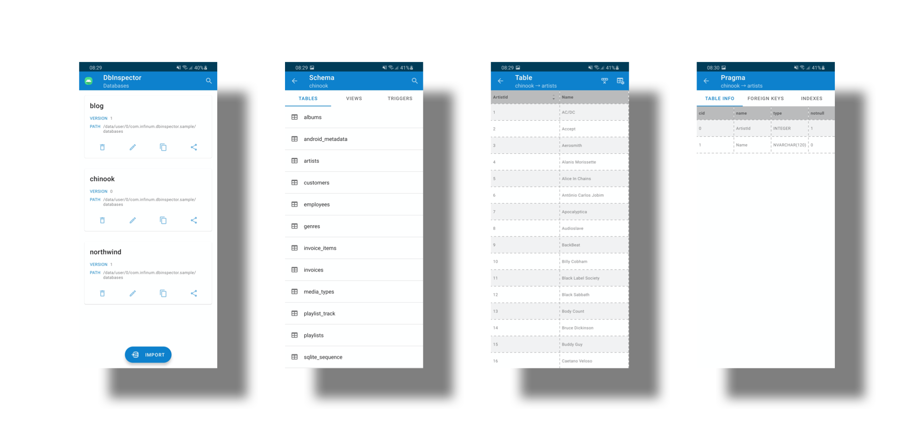
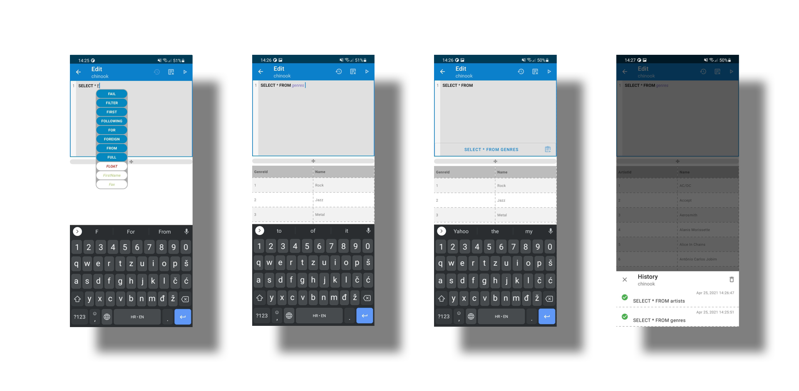

   [](https://www.codefactor.io/repository/github/infinum/android_dbinspector) [](https://codecov.io/gh/infinum/android_dbinspector)

### 
# DbInspector



_DbInspector_ provides a simple way to view the contents of the in-app database for debugging purposes.
There is no need to pull the database from a connected device.
This library also supports inspecting of the SQLite databases created by CouchBase Lite out of the box.
With this library you can:
* preview all application sandbox databases
* import single or multiple databases at once
* search, delete, rename, copy, share a database
* preview tables, views and triggers
* preview table or view pragma
* delete table contents
* drop view or trigger
* search table, view or trigger
* sort table, view or trigger per column
* execute any valid SQL command in editor per database connection

## Getting started
To include _DbInspector_ in your project, you have to add buildscript dependencies in your project level `build.gradle` or `build.gradle.kts`:

**Groovy**
```groovy
buildscript {
    repositories {
        mavenCentral()
    }
}
```
**KotlinDSL**
```kotlin
buildscript {
    repositories {
        mavenCentral()
    }
}
```

Then add the following dependencies in your app `build.gradle` or `build.gradle.kts` :

**Groovy**
```groovy
debugImplementation "com.infinum.dbinspector:dbinspector:5.4.9"
releaseImplementation "com.infinum.dbinspector:dbinspector-no-op:5.4.9"
```
**KotlinDSL**
```kotlin
debugImplementation("com.infinum.dbinspector:dbinspector:5.4.9")
releaseImplementation("com.infinum.dbinspector:dbinspector-no-op:5.4.9")
```

### Usage
_DbInspector_ can be invoked **explicitly** or **implicitly**.
* explicitly - call _DbInspector.show()_ anywhere and anytime that you see fit, like _onClick_ methods, lambdas or similar.
* implicitly - when you add the _dbinspector_ package an Activity alias is automatically merged into your application manifest that in return creates a launcher icon for _DbInspector_,
but when you add the _dbinspector-no-op_ the same Activity alias node is automatically removed from your application manifest.
Implicit way can be tweaked to achieve desired behaviour as demonstrated in an example below.

**Explicit**
```kotlin
DbInspector.show()
```
**Implicit**
If you use _dbinspector_ package but *do not want* an additional automatic launcher icon merged in and generated.
```xml
<!--suppress AndroidDomInspection -->
<activity-alias
    android:name="com.infinum.dbinspector.DbInspectorActivity"
    tools:node="remove" />
```
If you use _DbInspector_ for a specific flavor and need to override merged in launcher label, you can provide a String resource in your project exactly like this:
```xml
<string name="dbinspector_launcher_name">Sample Debug</string>
```
Please do mind and copy over the suppression comment line too, if you need it.
Further modification can be done according to rules of [manifest merging](https://developer.android.com/studio/build/manifest-merge) and attributes of [activity-alias](https://developer.android.com/guide/topics/manifest/activity-alias-element) XML node.

## Editor



_DbInspector_ has a build in editor scoped per database connection currently used.  
It offers autocomplete of SQLite3 keywords and functions, current table and column names.  
Built in editor also provides a history of executed statements, not matter if they were successful or not.  
History of statements is persisted between sessions and can be cleared on demand at any point.  
Panes between editors' input and result are scalable and can be adjusted by dragging the splitter between them.  
Landscape mode is supported too for better result preview of large datasets.  

## Logging
_DbInspector_ provides a independent and built in logger mechanism. Per default logger is initiated as an `EmptyLogger` omitting any output whatsoever.  
In case logs output is required, `AndroidLogger` should be used as shown below:
```kotlin
DbInspector.show(logger = AndroidLogger())
```
Additionally, `AndroidLogger` uses `Level` to filter out between info, debug, error or no messages at all.

## Requirements
Minimum required API level to use _DbInspector_ is **21** known as [Android 5.0, Lollipop](https://www.android.com/versions/lollipop-5-0/).
As of 4.0.0 version, AndroidX is required. If you cannot unfortunately migrate your project, keep the previous version until you get the opportunity to migrate to AndroidX.
_DbInspector_ is written entirely in Kotlin, but also works with Java only projects and all combinations of both.

## License

```
Copyright 2020 Infinum

Licensed under the Apache License, Version 2.0 (the "License");
you may not use this file except in compliance with the License.
You may obtain a copy of the License at

   http://www.apache.org/licenses/LICENSE-2.0

Unless required by applicable law or agreed to in writing, software
distributed under the License is distributed on an "AS IS" BASIS,
WITHOUT WARRANTIES OR CONDITIONS OF ANY KIND, either express or implied.
See the License for the specific language governing permissions and
limitations under the License.
```

## Credits
Maintained and sponsored by [Infinum](http://www.infinum.com).

<p align="center">
  <a href='https://infinum.com'>
    <picture>
        <source srcset="https://assets.infinum.com/brand/logo/static/white.svg" media="(prefers-color-scheme: dark)">
        
    </picture>
  </a>
</p>
